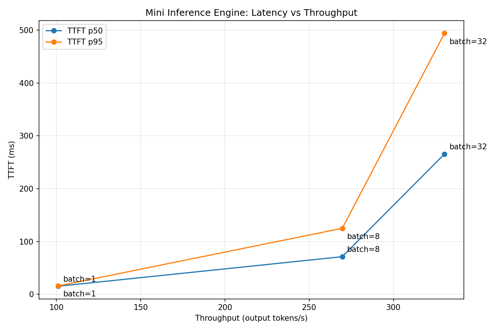
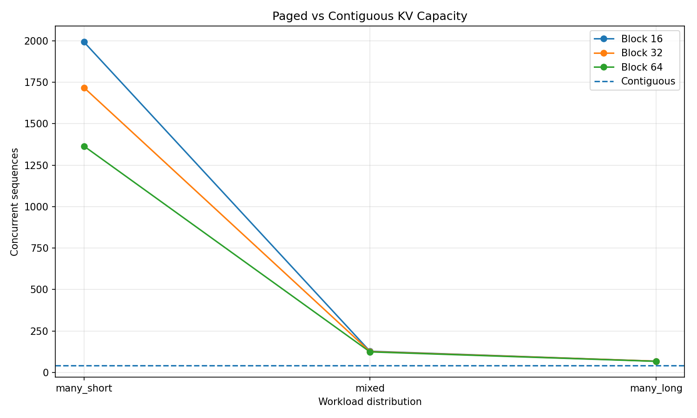

# Mini Inference Engine

A from-scratch LLM inference engine focused on the core mechanisms behind modern high-throughput serving systems. Implements prefill/decode execution, KV caching, continuous batching, paged KV memory, block-table management, and a reproducible inference benchmark harness in PyTorch.

The project then compares the implementation against vLLM and evaluates BF16, GPTQ, and AWQ serving for an Algerian Darija DPO model.

---

# Why This Project?

Most LLM projects focus on **training models** or using existing inference frameworks.

This project focuses on a different question:

> **What actually happens between an incoming generation request and the tokens produced by an LLM server?**

The engine is built incrementally from first principles before studying the corresponding production mechanisms in vLLM.

The project emphasizes **correctness, reproducibility, and measured performance**, rather than presenting unexplained throughput numbers.


---


# What It Implements

## Core Inference

* Model adapter and generation interface
* Explicit prefill/decode execution paths
* Pre-allocated KV cache
* Cached autoregressive generation
* Deterministic sampling
* Per-request generation state
* Per-request decode positions

## Scheduling

* Request queue
* Static batching baseline
* FCFS continuous batching
* Token-level request admission and eviction
* Ragged active batches

## Memory Management

* Contiguous KV-cache baseline
* Fixed-size KV block pool
* Free-list allocation
* Logical-to-physical block tables
* Paged KV attention
* KV memory utilization and fragmentation analysis

## Benchmarking

Measures:

* Time To First Token (TTFT)
* Inter-Token Latency (ITL)
* Time Per Output Token (TPOT)
* Throughput
* p50 latency
* p95 latency
* Error and timeout rates
* Latency-throughput curves
* Peak GPU memory

Every reported benchmark includes a complete workload specification.


---

# Results First

The mini engine has been validated through correctness tests and controlled inference benchmarks.

Run the full test suite with:

```bash
pytest -q
```

---

### Latency vs Throughput

The continuous batching benchmark evaluates concurrency levels of 1, 8, and 32 using the same general prompt and output distributions.

| Batch |  TTFT p50 |  TTFT p95 |  ITL p50 |  ITL p95 |   Throughput |
| ----: | --------: | --------: | -------: | -------: | -----------: |
|     1 |  15.63 ms |  16.18 ms |  9.73 ms | 10.52 ms | 100.40 tok/s |
|     8 |  71.18 ms | 125.67 ms | 27.65 ms | 29.26 ms | 273.02 tok/s |
|    32 | 259.45 ms | 486.96 ms | 87.83 ms | 93.42 ms | 337.92 tok/s |

The main result is the expected **latency-throughput trade-off**:

* Batch 1 provides the lowest latency.
* Batch 8 provides a large throughput improvement.
* Batch 32 reaches the highest throughput, but with substantially higher latency.

Throughput increases from:

```text
100.40 tok/s
```

at batch 1 to:

```text
337.92 tok/s
```

at batch 32, approximately **3.37×**.

However, the scaling is not linear. The largest throughput improvement occurs between batch 1 and batch 8, while the improvement from batch 8 to batch 32 is much smaller.

This demonstrates why an inference server cannot optimize throughput independently of latency requirements.

#### GPU Memory

Peak allocated GPU memory was also measured:

| Batch | Peak GPU Memory |
| ----: | --------------: |
|     1 |      1019.01 MB |
|     8 |      1176.70 MB |
|    32 |      1716.70 MB |

Memory usage increases as more requests remain active simultaneously, demonstrating the interaction between concurrency and KV-cache memory requirements.

#### Benchmark Environment

The measurements above use:

```text
Model:        Qwen/Qwen2.5-0.5B-Instruct
Device:       NVIDIA RTX 3050 Laptop GPU 4 GB
Precision:    BF16
Decoding:     Greedy
Concurrency:  1 / 8 / 32
```

Warmup runs are excluded from the reported measurements.

**Experiment:**

[EXP-2026-017 — Latency vs Throughput](experiments/EXP-2026-017.md)



---


# Architecture


```text
                    +-----------------+
                    |  Generation API |
                    +--------+--------+
                             |
                             v
                    +-----------------+
                    | Request Manager |
                    +--------+--------+
                            │
                    +--------+------------+
                    | Continuous Batching |
                    +--------+------------+

                            │
                            ▼
                   ┌─────────────────┐
                   │ Prefill / Decode│
                   └────────┬────────┘
                            │
                            ▼
                        KV Cache
                            │
              ┌─────────────┴─────────────┐
              │                           │
              ▼                           ▼
       Contiguous KV                  Paged KV
              │                           │
              │                    ┌──────┴──────┐
              │                    │             │
              │               Block Table    Block Pool
              │                    │             │
              └────────────┬───────┴─────────────┘
                            ▼
                       Attention
                            │
                            ▼
                     Token Generation
```
---

# Prefill and Decode

The engine explicitly separates the two phases of autoregressive generation.

For a prompt of length $T$, prefill processes:

$$
X \in \mathbb{R}^{B \times T \times d_{model}}
$$

and populates the KV cache.

During decode, each iteration processes the newly generated token:

$$
X_t \in \mathbb{R}^{B \times 1 \times d_{model}}
$$

while reusing previously computed keys and values.

For layer $l$, the cached tensors have the conceptual shape:

$$
K_l, V_l \in \mathbb{R}^{B \times H \times T \times d_h}
$$

where:

$$
d_{model} = H d_h
$$

This separation allows the project to measure prefill and decode behavior independently.

---

# KV Cache

Without caching, autoregressive generation repeatedly recomputes the keys and values for previous tokens.

With caching, previously computed:

$$
K_{1:t-1}, V_{1:t-1}
$$

are retained and only:

$$
K_t, V_t
$$

are computed for the new token.

The implementation validates this optimization through deterministic cached-vs-uncached generation tests.

The correctness requirement is:

$$
y^{cached}_{1:T} = y^{uncached}_{1:T}
$$

for the tested deterministic workloads.

The correctness suite also validates that cached decoding handles sequence positions correctly. This is particularly important because the KV cache is indexed by sequence position, and an incorrect position or offset can cause the cached path to diverge from the reference even when the model itself is correct.

## Debugging Principle

> **Do not debug from the final wrong token. Find the first divergence.**

When cached and uncached execution produce different results, trace the computation in this order:

```text
Prompt
  ↓
Tokenization
  ↓
Prefill
  ↓
KV cache contents
  ↓
Decode position
  ↓
Position IDs / RoPE
  ↓
KV cache update
  ↓
KV cache read
  ↓
Attention
  ↓
Logits
  ↓
Generated token
  ↓
Next decode position
```

This makes it possible to distinguish between:

* a genuine logical correctness bug;
* an incorrect cache position or offset;
* an incorrect attention mask;
* a paged-memory mapping error;
* or a small numerical difference caused by different execution paths.

The debugging procedure is documented in:

[KV-Cache Bug Playbook](bugs/KV_CACHE_BUG_PLAYBOOK.md)

---

# Continuous Batching

The project first implements static batching as a baseline.

It then introduces token-level continuous batching:

```text
Waiting requests
       |
       v
   Scheduler
       |
       v
 Active batch
       |
       v
  Decode step
       |
   +---+---+
   |       |
   v       v
Finished  Active
   |       |
  Evict    |
   |       |
   +---+---+
       |
       v
Admit waiting requests
```

Each decode iteration processes one token for every active request. When a request finishes, it is evicted from the active set and a waiting request can be admitted into the newly available slot.

This allows the engine to maintain a higher level of active batch capacity when requests have different output lengths.

The implementation is evaluated against the static batching baseline using workloads with variable generation lengths, measuring:

* Throughput
* TTFT
* ITL
* p50 latency
* p95 latency

The continuous batching benchmark demonstrates how increasing concurrency can substantially improve workload-level throughput while increasing per-request latency.

**For More Information:**

[EXP-2026-014 — Static vs Continuous Batching](experiments/EXP-2026-014.md)

[Continuous Batching Documentation](docs/static_vs_continuous.md)

**Related Paper:**

[Orca: A Distributed Serving System for Transformer-Based Generative Models](https://www.usenix.org/conference/osdi22/presentation/yu)

---

# Paged KV Memory

The project implements a simplified paged KV-memory system inspired by the ideas behind PagedAttention.

Instead of requiring each sequence to occupy one contiguous KV allocation, KV memory is divided into fixed-size blocks.

A logical sequence:

```text
Logical blocks:
[0, 1, 2, 3]
```

can be mapped to arbitrary physical blocks:

```text
Physical blocks:
[7, 2, 13, 4]
```

through a block table:

$$
BlockTable_i[j] = p
$$

Attention then gathers the required keys and values through this logical-to-physical mapping.

The project evaluates the resulting memory utilization and estimated concurrent sequence capacity compared with contiguous KV allocation.

The implementation includes:

* `BlockPool`
* physical block allocation
* free-list management
* block release
* `BlockTable`
* logical-to-physical mapping
* paged KV attention

**For More Information:**

* [EXP-2026-015 — Contiguous KV Memory Baseline and Fragmentation](experiments/EXP-2026-015.md)
* [EXP-2026-016 — Paged vs Contiguous KV Memory Utilization](experiments/EXP-2026-016.md)



**Related Paper:**

[Efficient Memory Management for Large Language Model Serving with PagedAttention](https://arxiv.org/pdf/2309.06180)

---

# Benchmarking Philosophy

A central rule of the project is:

> **No benchmark number is reported without a workload specification.**

Inference performance depends on the complete experimental setup.

Each benchmark records:

```text
Hardware
Model
Model revision
Dtype / quantization
Prompt-length distribution
Output-length distribution
Concurrency
Request arrival pattern
Sampling configuration
Warmup requests
Measured requests
Software environment
Git commit
```

A throughput result should therefore be interpreted as:

$$
Throughput = f(engine, hardware, model, workload)
$$

This prevents isolated numbers such as `500 tokens/sec` from being presented without the conditions that produced them.

**For More Information:**

* [Benchmark Metrics & Measurement Documentation](docs/benchmark-metrics.md)
* [EXP-2026-017 — Latency vs Throughput](experiments/EXP-2026-017.md)


---

# Experimental Workloads

The benchmark suite progressively introduces more realistic serving conditions.

## S1 — Single Request

```text
Concurrency: 1
Prompt length: fixed
Output length: fixed
Deterministic decoding
```

Used for:

* KV-cache correctness
* prefill/decode timing
* cached vs uncached comparison

## S2 — Variable-Length Requests

Introduces different prompt and generation lengths.

Used for:

* batching behavior
* scheduler behavior
* KV memory utilization

## S3 — Concurrent Requests

Introduces multiple simultaneous requests.

Used for:

* static vs continuous batching
* throughput
* TTFT
* ITL

## S4 — Saturation

Concurrency is progressively increased to identify the point where throughput stops scaling and latency begins increasing sharply.

---

# Metrics

## TTFT

Time To First Token:

$$
TTFT = t_{first} - t_{request}
$$

where:

* $t_{first}$ is the timestamp of the first generated token
* $t_{request}$ is the request arrival timestamp

## ITL

For consecutive generated tokens:

$$
ITL_i = t_i - t_{i-1}
$$

## TPOT

Time Per Output Token:

$$
TPOT = \frac{T_{decode}}{N_{output}}
$$

where:

* $T_{decode}$ is the decode time
* $N_{output}$ is the number of generated tokens

## Throughput

Output-token throughput:

$$
Throughput = \frac{N_{output}}{T_{wall}}
$$

reported in output tokens/sec.

## Percentiles

For a latency distribution $x$:

$$
p50 = percentile(x, 50)
$$

$$
p95 = percentile(x, 95)
$$

Mean latency may also be reported, but it is not treated as a sufficient characterization of serving performance.

---

# Mini Engine → vLLM

After implementing the core mechanisms from scratch, the project moves to vLLM.

The comparison is performed under controlled workloads:

```text
Same model
Same hardware
Same dtype
Same workload
        |
   +----+----+
   |         |
   v         v
Mini Engine  vLLM
   |         |
   +----+----+
        |
        v
Performance comparison
        |
        v
Gap decomposition
```

The objective is not simply to show that vLLM is faster.

The project investigates **why** the production system is faster, including areas such as:

* optimized GPU kernels
* scheduling
* KV-cache management
* CUDA graphs
* batching
* memory management
* framework/runtime overhead

Measured effects are distinguished from architectural inferences that cannot be isolated experimentally.


**More information:**

* [vLLM on NVIDIA T4](commands/vllm_t4.md)


---

# Quantized Serving

The final stage applies the inference stack to an Algerian Darija DPO model.

The serving comparison evaluates:

* BF16
* GPTQ
* AWQ

against a common evaluation and serving workload.

The resulting trade-off is studied across:

$$
quality \leftrightarrow memory \leftrightarrow latency
$$

Quality is evaluated using AlgerianMMLU rather than assuming that quantization preserves model quality for free.

The selected model is exposed through a streaming API:

```text
vLLM
  |
  v
FastAPI
  |
  v
SSE streaming
  |
  v
Load testing
```

---

# Evidence

The project treats implementation and evidence as separate deliverables.

| Component           | Implementation           | Evidence                      |
| ------------------- | ------------------------ | ----------------------------- |
| KV cache            | Cache allocation/update  | Cached = uncached             |
| Prefill/decode      | Separate execution paths | Phase timing                  |
| Static batching     | Batch executor           | Baseline throughput           |
| Continuous batching | FCFS scheduler           | Throughput/latency comparison |
| Paged KV            | Block pool + block table | Memory utilization            |
| Paged attention     | KV gathering             | Correctness tests             |
| Benchmarking        | Metrics harness          | Reproducible curves           |
| vLLM                | Production deployment    | Load-test results             |
| Quantization        | GPTQ/AWQ                 | Quality/memory/latency table  |

---

# Repository Structure

```text
mini-inference-engine/
├── engine/
│   ├── __init__.py
│   ├── model_adapter.py
│   ├── request.py
│   ├── generation.py
│   ├── kv_cache.py
│   ├── scheduler.py
│   ├── block_pool.py
│   ├── block_table.py
│   └── attention.py
│
├── bench/
│   ├── workloads.py
│   ├── generator.py
│   ├── metrics.py
│   ├── runner.py
│   └── plots.py
│
├── tests/
│   ├── test_generation.py
│   ├── test_kv_cache.py
│   ├── test_scheduler.py
│   ├── test_block_pool.py
│   ├── test_block_table.py
│   └── test_paged_attention.py
│
├── serve/
│   ├── fastapi_app.py
│   └── locustfile.py
│
├── configs/
│   ├── workload_single.yaml
│   ├── workload_batch.yaml
│   └── workload_saturation.yaml
│
├── experiments/
│   └── results/
│
├── docs/
│   ├── architecture.md
│   ├── environment.md
│   ├── workload_contract.md
│   ├── inference_glossary.md
│   └── kv_cache_bug_playbook.md
│
├── scripts/
│   ├── benchmark.py
│   └── plot_results.py
│
├── bugs/
│   └── KV_CACHE_BUG_PLAYBOOK.md
│
├── pyproject.toml
└── README.md
```

---

# Project Outcome

The final artifact demonstrates an end-to-end understanding of modern LLM inference:

$$
Request
\rightarrow
Scheduling
\rightarrow
Prefill
\rightarrow
KV\ Cache
\rightarrow
Decode
\rightarrow
Batching
\rightarrow
Paged\ Memory
\rightarrow
Serving
$$

Rather than treating inference frameworks as black boxes, the project builds simplified versions of their fundamental mechanisms, validates them experimentally, and then connects those mechanisms to a production serving system.

---

# Status

```text
M0  Scope, workload contract, environment        ✓
M1  KV cache and generation                      ✓
M2  Continuous batching                          ✓
M3  Paged KV memory                              ✓
M4  Benchmark harness + documentation            ✓
M5  vLLM deployment and gap analysis             ⬜
M6  Quantized Darija model serving               ⬜
```

## Current Position

The mini inference engine has reached the point where its core mechanisms are implemented, tested, and benchmarked.

The next stage is **vLLM**: use the mini engine as a mechanism-level baseline, reproduce the equivalent serving workload, and investigate where the production system gains performance.
