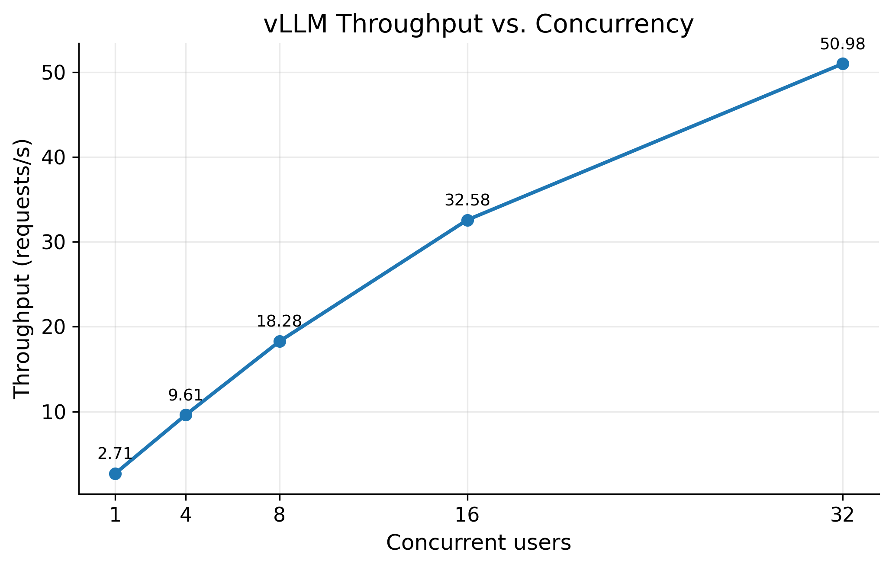
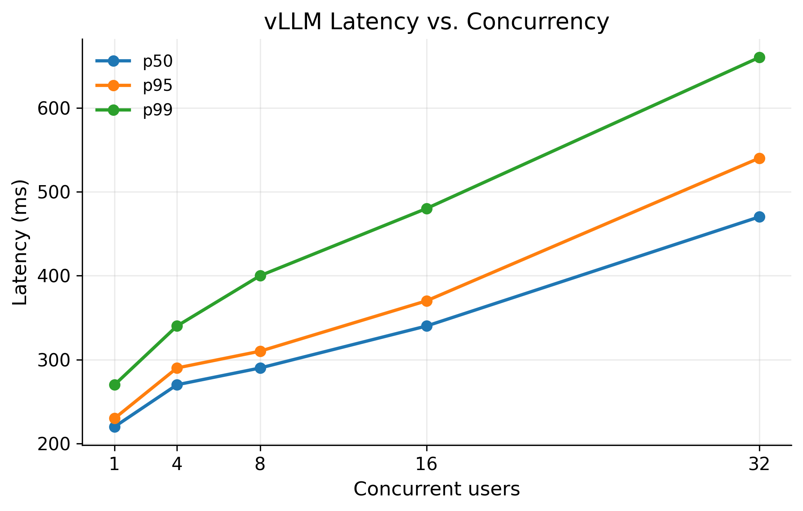
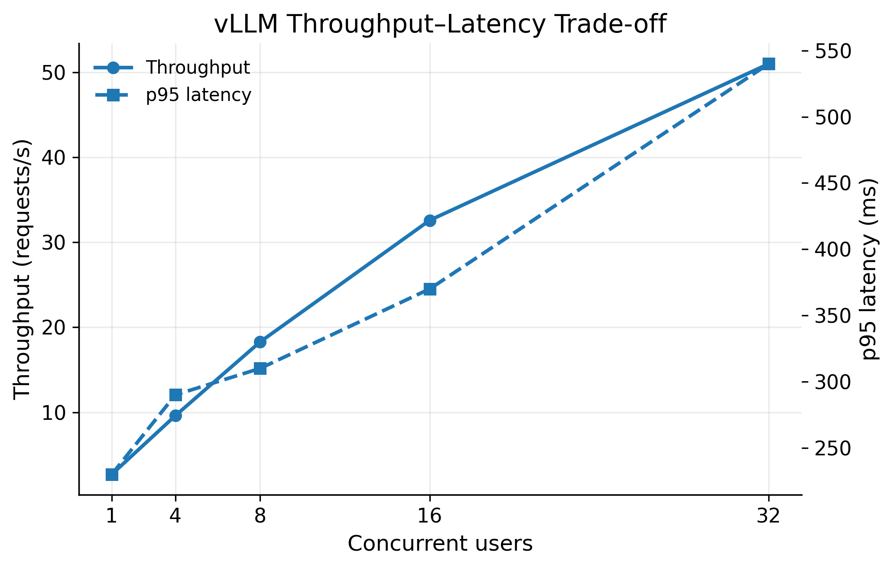

# EXP-2026-017 — vLLM Concurrency Load Test

## Objective

Measure how the vLLM OpenAI-compatible serving endpoint behaves as concurrent client load increases.

The goal is to identify:

* throughput scaling with concurrency,
* latency degradation under load,
* the point where additional concurrency produces diminishing throughput gains,
* request failures/timeouts,
* evidence of approaching saturation.

This experiment complements the Mini Inference Engine benchmark by testing a production inference server under concurrent HTTP workload.

---

## Environment

| Component            | Value                          |
| -------------------- | ------------------------------ |
| GPU                  | NVIDIA Tesla T4                |
| GPU memory           | 16 GB                          |
| vLLM                 | 0.28.0                         |
| PyTorch              | 2.13.0+cu130                   |
| CUDA                 | Available                      |
| Locust               | 2.46.4                         |
| Model                | `Qwen/Qwen2.5-7B-Instruct-AWQ` |
| Quantization         | AWQ 4-bit                      |
| Tensor parallelism   | 1                              |
| Maximum model length | 2048                           |
| Server endpoint      | `http://127.0.0.1:8000`        |

---

## vLLM Launch Configuration

The server was launched with:

```bash
vllm serve Qwen/Qwen2.5-7B-Instruct-AWQ \
    --tensor-parallel-size 1 \
    --max-model-len 2048
```

The server exposed an OpenAI-compatible API, including:

```text
POST /v1/chat/completions
GET  /v1/models
GET  /metrics
```

The OpenAI-compatible API is provided by vLLM's serving layer.

---

## Load Generator

Load was generated using Locust 2.46.4.

The test client sends requests to:

```text
/v1/chat/completions
```

Each request uses:

```python
{
    "model": "Qwen/Qwen2.5-7B-Instruct-AWQ",
    "messages": [
        {
            "role": "user",
            "content": prompt,
        }
    ],
    "max_tokens": 10,
    "temperature": 0.0,
}
```

### Client behavior

Each Locust user repeatedly sends requests with:

```python
wait_time = between(0.1, 0.2)
```

Prompts are sampled randomly from the workload prompt set.

The maximum generation length is explicitly limited to:

```text
10 tokens
```

This prevents request output length from becoming an uncontrolled variable during the concurrency experiment.

Temperature is set to:

```text
0.0
```

to make the workload deterministic and reduce variability from sampling.

Requests are considered successful only when:

1. HTTP status code is `200`,
2. the response is valid JSON,
3. the response contains at least one choice.

---

## Locust Command

Each concurrency level was executed for 30 seconds.

Example:

```bash
locust \
    -f serve/locustfile.py \
    --host http://127.0.0.1:8000 \
    --headless \
    -u 32 \
    -r 32 \
    -t 30s \
    --csv experiments/vllm_load/results/ramp_32
```

The same procedure was used for:

```text
1
4
8
16
32
```

users.

The CSV output contains:

```text
*_stats.csv
*_stats_history.csv
*_failures.csv
*_exceptions.csv
```

---

# Results

## Concurrency Ramp

| Concurrent users | Requests | Failures | Avg latency |    p50 |    p95 |    p99 |  Throughput |
| ---------------: | -------: | -------: | ----------: | -----: | -----: | -----: | ----------: |
|                1 |       80 |        0 |      221 ms | 220 ms | 230 ms | 270 ms |  2.71 req/s |
|                4 |      286 |        0 |      264 ms | 270 ms | 290 ms | 340 ms |  9.61 req/s |
|                8 |      543 |        0 |      286 ms | 290 ms | 310 ms | 400 ms | 18.28 req/s |
|               16 |      969 |        0 |      341 ms | 340 ms | 370 ms | 480 ms | 32.58 req/s |
|               32 |     1520 |        0 |      471 ms | 470 ms | 540 ms | 660 ms | 50.98 req/s |

---

## Throughput Scaling

Throughput increased substantially as concurrency increased.



**Figure 1 — Throughput as a function of concurrent users.**

Throughput increased from:

```text
2.71 req/s
```

at one concurrent user to:

```text
50.98 req/s
```

at 32 concurrent users.

This corresponds to an approximately:

```text
18.8×
```

increase in throughput for a 32× increase in concurrency.

The successive throughput increases were:

```text
1 → 4 users:     2.71 →  9.61 req/s
4 → 8 users:     9.61 → 18.28 req/s
8 → 16 users:   18.28 → 32.58 req/s
16 → 32 users:  32.58 → 50.98 req/s
```

The curve remains increasing throughout the tested range. Therefore, the measurements do not show a clear throughput plateau by 32 concurrent users.

---

## Latency Scaling

Latency increased progressively with concurrency, particularly in the tail of the distribution.



**Figure 2 — p50, p95, and p99 request latency as a function of concurrent users.**

Median latency increased:

```text
220 ms
→ 270 ms
→ 290 ms
→ 340 ms
→ 470 ms
```

from 1 to 32 users.

The p95 latency increased:

```text
230 ms
→ 290 ms
→ 310 ms
→ 370 ms
→ 540 ms
```

The p99 latency increased:

```text
270 ms
→ 340 ms
→ 400 ms
→ 480 ms
→ 660 ms
```

The widening separation between median and tail latency at higher concurrency indicates increasing variability in request completion time.

This is consistent with greater scheduling and queueing pressure as more requests compete for the same GPU resources.

---

## Throughput–Latency Trade-off

The relationship between throughput and latency is summarized below.



**Figure 3 — Throughput and p95 latency under increasing concurrency.**

Increasing concurrency provides higher aggregate throughput, but this comes with progressively higher p95 latency.

At 16 users:

```text
Throughput = 32.58 req/s
p95 latency = 370 ms
```

At 32 users:

```text
Throughput = 50.98 req/s
p95 latency = 540 ms
```

Thus, the additional concurrency continues to improve throughput, but the latency cost becomes increasingly significant.

---

## 32-User Run

The final 32-user run produced:

```text
Requests:       1520
Failures:          0

Average:        471 ms
Minimum:        299 ms
Maximum:        671 ms
Median:         470 ms

p90:            520 ms
p95:            540 ms
p98:            600 ms
p99:            660 ms
p99.9:          670 ms

Throughput:     50.98 req/s
Failure rate:    0.00%
```

The complete 32-user raw results are stored under:

```text
experiments/vllm_load/results/ramp_32*
```

---

# Observations

## 1. Throughput increases with concurrency

Throughput increased from:

```text
2.71 req/s
```

at one concurrent user to:

```text
50.98 req/s
```

at 32 concurrent users.

This demonstrates that the server benefits substantially from additional concurrent requests, likely because the serving system can process multiple requests together and maintain better GPU utilization.

However, the throughput curve does not flatten within the tested range. Consequently, the experiment does not establish the maximum achievable throughput.

---

## 2. Latency increases under load

Both central and tail latency increased as concurrency increased.

The most pronounced change occurs between 16 and 32 users:

```text
p50:  340 → 470 ms
p95:  370 → 540 ms
p99:  480 → 660 ms
```

This indicates that the cost of additional concurrency is not simply a small increase in average latency. The tail of the latency distribution also shifts upward substantially.

---

## 3. No request failures were observed

All tested concurrency levels completed with:

```text
0 failures
```

including the 32-user run.

Therefore, the experiment did not encounter an HTTP-level overload failure, timeout, or server crash within the tested 30-second windows.

---

## 4. Diminishing throughput efficiency

Although throughput increased at every concurrency level, the scaling efficiency decreased as concurrency increased.

A useful way to see this is to compare the throughput gain with the increase in concurrency:

| Transition | Concurrency increase | Throughput increase | Scaling efficiency |
| ---------- | -------------------: | ------------------: | -----------------: |
| 1 → 4      |                   4× |               3.55× |              88.8% |
| 4 → 8      |                   2× |               1.90× |              95.1% |
| 8 → 16     |                   2× |               1.78× |              88.9% |
| 16 → 32    |                   2× |               1.56× |              77.9% |

The 16 → 32 transition shows the clearest reduction in scaling efficiency.

This is evidence of diminishing returns, although it should not be interpreted as proof that the server has reached saturation.

---

## 5. 32 users indicates high load, but not hard saturation

At 32 users:

```text
Throughput = 50.98 req/s
p95 latency = 540 ms
p99 latency = 660 ms
```

Throughput was still increasing substantially compared with 16 users:

```text
32.58 → 50.98 req/s
```

Therefore, 32 concurrent users should **not** be described as the exact saturation point.

A more accurate interpretation is:

> 32 concurrent users place the server under high load and show clear latency degradation and diminishing throughput gains, but the experiment does not establish a hard throughput ceiling.

A higher concurrency level should be tested if the objective is to locate the actual throughput plateau or saturation point.

---

# Important Measurement Limitation

Locust latency represents the end-to-end HTTP request latency.

It should **not** be interpreted as pure TTFT.

For these non-streaming requests:

```text
Locust latency
    ≈
    time to first token
    + token generation time
    + HTTP/client overhead
```

The request does not complete until the generated response is returned.

Therefore, this experiment measures:

```text
request latency
throughput
failure rate
```

rather than directly measuring:

```text
TTFT
ITL
```

Those internal serving metrics require server-side instrumentation or streaming/per-request timing.

vLLM provides Prometheus metrics through `/metrics`, including scheduler and KV-cache-related metrics such as running requests, KV-cache usage, prompt tokens, and generation tokens. These metrics can be used in subsequent analysis.

---

# Interpretation

The concurrency ramp demonstrates the classic serving trade-off:

```text
Increasing concurrency
        │
        ▼
More requests available
        │
        ▼
Better batching / GPU utilization
        │
        ▼
Higher throughput
        │
        ▼
More queueing under load
        │
        ▼
Higher tail latency
```

The results provide empirical evidence that increasing concurrency improves aggregate serving throughput while simultaneously increasing request latency and tail-latency variability.

The important result is therefore not simply:

```text
32 users → 50.98 req/s
```

but rather the observed **throughput–latency trade-off** across the complete concurrency range.

---

# Raw Results

Raw Locust results:

```text
experiments/vllm_load/results/
```

Expected files include:

```text
ramp_1_stats.csv
ramp_1_stats_history.csv
ramp_1_failures.csv
ramp_1_exceptions.csv

ramp_4_stats.csv
ramp_4_stats_history.csv
ramp_4_failures.csv
ramp_4_exceptions.csv

ramp_8_stats.csv
ramp_8_stats_history.csv
ramp_8_failures.csv
ramp_8_exceptions.csv

ramp_16_stats.csv
ramp_16_stats_history.csv
ramp_16_failures.csv
ramp_16_exceptions.csv

ramp_32_stats.csv
ramp_32_stats_history.csv
ramp_32_failures.csv
ramp_32_exceptions.csv
```

---

# Reproducibility

To reproduce the experiment:

### 1. Start vLLM

```bash
vllm serve Qwen/Qwen2.5-7B-Instruct-AWQ \
    --tensor-parallel-size 1 \
    --max-model-len 2048
```

### 2. Validate the endpoint

```bash
curl http://127.0.0.1:8000/v1/models
```

### 3. Run Locust

```bash
locust \
    -f serve/locustfile.py \
    --host http://127.0.0.1:8000 \
    --headless \
    -u 32 \
    -r 32 \
    -t 30s \
    --csv experiments/vllm_load/results/ramp_32
```

Repeat for:

```text
1, 4, 8, 16, 32
```

concurrent users.

---

# Conclusion

The vLLM endpoint successfully handled the complete concurrency ramp from 1 to 32 concurrent users with:

```text
0% request failures
```

Throughput increased from:

```text
2.71 req/s → 50.98 req/s
```

while p95 latency increased from:

```text
230 ms → 540 ms
```

and p99 latency increased from:

```text
270 ms → 660 ms
```

The experiment therefore demonstrates a clear throughput–latency trade-off:

```text
Higher concurrency
        ↓
Higher throughput
        +
Higher latency / tail latency
```

Throughput was still increasing at 32 users, so the experiment does not establish a hard saturation point. Instead, it establishes that the tested server scales effectively with concurrency while exhibiting increasingly significant latency degradation at higher load.

A natural next step is to extend the concurrency sweep beyond 32 users and combine Locust measurements with vLLM `/metrics` data to determine where throughput plateaus and where GPU/KV-cache/scheduler pressure becomes the limiting factor.
